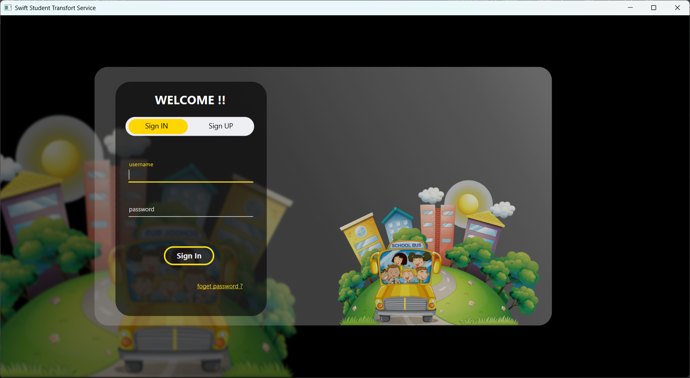
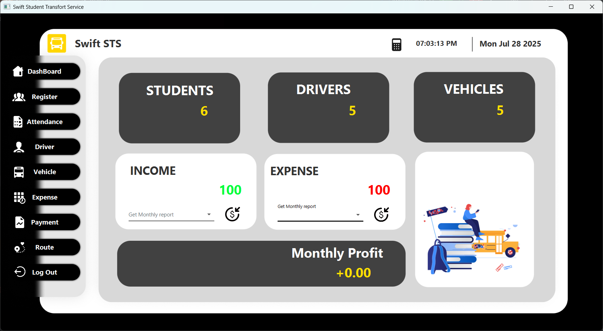

# Swift Student Transport Service (SwiftSTS)

A professional layered JavaFX application designed to simplify student transportation management, including attendance tracking, payment calculation, and driver-vehicle coordination. Built with Java, MySQL, and Scene Builder, this project follows clean architecture principles.

---

## 🚀 Features

* 🧑‍🎓 Student Management (CRUD)

* 🚌 Driver & Vehicle Management(CRUD)

* 📅 Attendance Tracking (Day/Month Based)

* 💰 Monthly Payment Calculation based on **Student attendance**

* 🔐 Role-based Login System (Admin & Driver)

* 📩 Password Recovery via Email

* 🧾JasperReports Integration for professional **Payment Receipt Generation**

* 📊 Dashboard Overview
---

## 🧱 Architecture

This is a **Layered Architecture** project:

* **Presentation Layer** (JavaFX)
* **Service Layer** (Handles business logic)
* **Data Access Layer** (DAO pattern using MySQL)
* **Model Layer** (POJOs / DTOs)

---

## 🛠️ Technologies Used

* Java 21
* JavaFX (FXML + Scene Builder)
* MySQL
* JDBC
* JFoenix
* Maven

---

## 📁 Project Structure

```
SwiftSTS-Layered/
├── src/
│   ├── controller/         # JavaFX controllers
│   ├── dao/                # Data access logic
│   ├── dto/                # Data Transfer Objects
│   ├── model/              # Domain models
│   ├── service/            # Business logic
│   ├── util/               # Utilities like DB connection
│   └── view/               # FXML files and UI
├── assets/                 # Images, icons
├── lib/                    # External libraries
├── README.md
├── pom.xml                 # Maven configuration
└── SwiftSTS.exe            # Bundled executable (optional)
```

---

## 🔧 Installation & Setup

1. **Clone the Repository**

```bash
git clone https://github.com/LithiraJK/SwiftSTS-Layerd.git
```

2. **Open in IntelliJ IDEA or VS Code**

    * Ensure you have JavaFX set up.

3. **Setup Database**

    * Import the SQL script in the `sql/` folder into MySQL.
    * Update database credentials in `DBConnection.java`.

4. **Run the Project**

    * Run `MainForm.java` to launch the app.

---

## 🎥 Demo Video

[Watch on LinkedIn](#) *(Replace with your video link)*

---

## 📷 Screenshots

| Login Form  | Admin Dashboard                            |
|-------------| ------------------------------------------ |
|  |  |

---

## 📄 License

This project is licensed under the MIT License.

---

## 📬 Contact

**Author:** Lithira Jayanaka

**Email:** [kariyawasamlithira2@gmail.com](mailto:kariyawasamlithira2@gmail.com)

---

